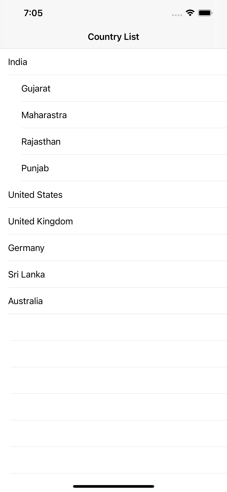
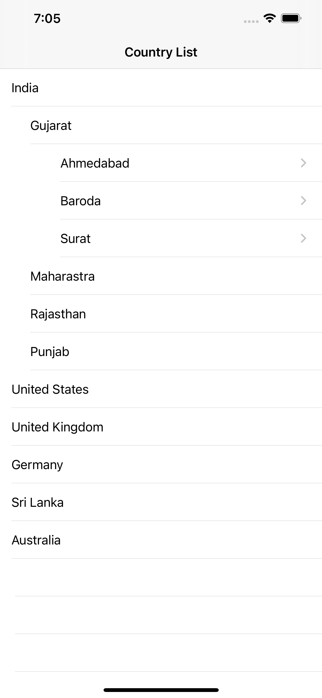

<h1>Introduction</h1>
INTUZ is presenting an interesting a Multilevel Expand/Collapse UITableView App Control to integrate inside your native iOS-based application. 
MultilevelTableView is a simple component, which lets you use the tableview with multilevel tree view in your project. 

  
<h1>Features</h1>

- Custom multilevel expand and collapse UITableView. 
- You can customze the layout, title and description of the new version.
- You can just drag and drop the model class and storyboard view in to your project to achive this. 
- Fully customizable layout.

  
<h1>Getting Started</h1>

To use this component in your project you need to perform the below steps:

> Steps to Integrate

1) Add `ViewController.swift` and `Main.Storyboard` viewcontroller at the required place on your code.

2) Just grag and drop the model folder in to your project to get all model class in to your project.

3) Also you can get the `CityData.plist` in to your project.

**Note:** Make sure that the extension which is used in this component has been added to your project. 

  
**<h1>Bugs and Feedback</h1>**
For bugs, questions and discussions please use the Github Issues.

  
**<h1>License</h1>**
The MIT License (MIT)
  
Copyright (c) 2020 INTUZ
  
Permission is hereby granted, free of charge, to any person obtaining a copy of this software and associated documentation files (the "Software"), to deal in the Software without restriction, including without limitation the rights to use, copy, modify, merge, publish, distribute, sublicense, and/or sell copies of the Software, and to permit persons to whom the Software is furnished to do so, subject to the following conditions: 
  
THE SOFTWARE IS PROVIDED "AS IS", WITHOUT WARRANTY OF ANY KIND, EXPRESS OR IMPLIED, INCLUDING BUT NOT LIMITED TO THE WARRANTIES OF MERCHANTABILITY, FITNESS FOR A PARTICULAR PURPOSE AND NONINFRINGEMENT. IN NO EVENT SHALL THE AUTHORS OR COPYRIGHT HOLDERS BE LIABLE FOR ANY CLAIM, DAMAGES OR OTHER LIABILITY, WHETHER IN AN ACTION OF CONTRACT, TORT OR OTHERWISE, ARISING FROM, OUT OF OR IN CONNECTION WITH THE SOFTWARE OR THE USE OR OTHER DEALINGS IN THE SOFTWARE.

 
<h1></h1>

